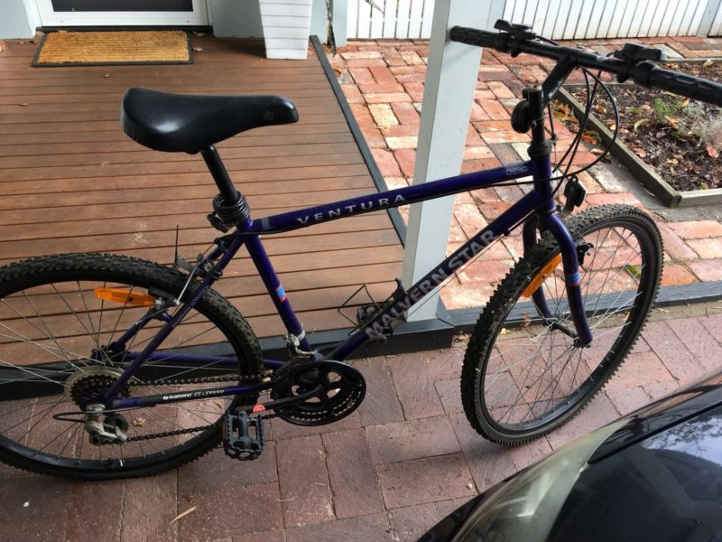
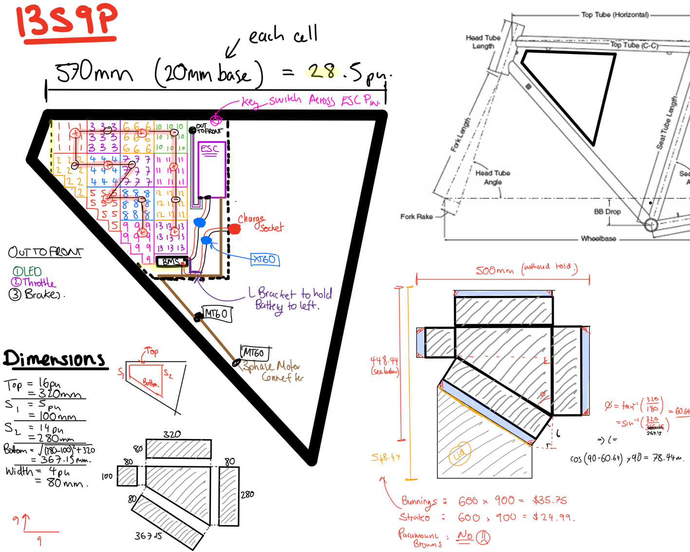
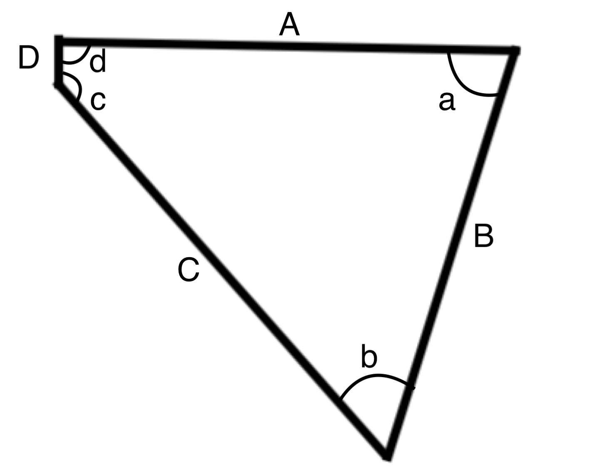
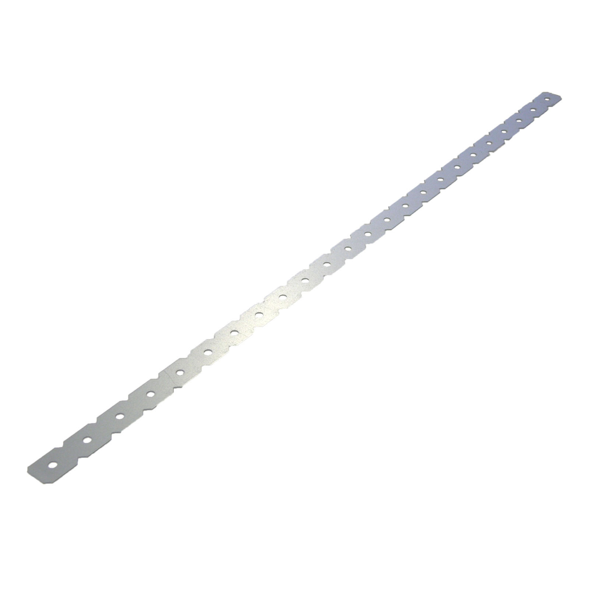

# Electronic Bike Design

# Table of Contents

<!-- MDTOC maxdepth:6 firsth1:2 numbering:0 flatten:0 bullets:1 updateOnSave:1 -->

- [Introduction](#Introduction)   
   - [Purpose](#Purpose)   
   - [Base Level Requirements](#Base-Level-Requirements)   
- [Design](#Design)   
   - [Motor](#Motor)   
      - [1500W (48V) Rear](#1500W-48V-Rear)   
      - [1000W (48V) Front](#1000W-48V-Front)   
      - [750W (2x350) Hoverboard Motors](#750W-2x350-Hoverboard-Motors)   
   - [Battery](#Battery)   
      - [Intital Caclulations and Estimation](#Intital-Caclulations-and-Estimation)   
      - [Futher Investigation](#Futher-Investigation)   
   - [Bike Frame](#Bike-Frame)   
   - [Battery Casing](#Battery-Casing)   
      - [Design Process](#Design-Process)   
      - [Specifications of PURCHASED bike Frame](#Specifications-of-PURCHASED-bike-Frame)   
      - [Sheet Metal](#Sheet-Metal)   
      - [Mounting to Bike Frame](#Mounting-to-Bike-Frame)   
         - [Carinya](#Carinya)   
   - [Electronic Speed Controller (ESC)](#Electronic-Speed-Controller-ESC)   
- [Budget](#Budget)   
- [Build Report and Parts Compilation](#Build-Report-and-Parts-Compilation)   
   - [Parts](#Parts)   
- [Evaluation](#Evaluation)   

<!-- /MDTOC -->

## Introduction

### Purpose

This project was intially formed to fill a need for a extended length transportaion and reliability when the electric skateboard is not a an option.

### Base Level Requirements

**Requirements**

+ ~$500 build budget
+ Hub Motors (To allow for continued use in the case of a malfunction)
+ Ride Time of ~45mins (with a <3hr charge time)
+ Built in BMS compatible with <$25 chargers (To leave at various locations)
+ Non pedal assist max speed (flat) >30km/h
+ Key Access
  + Inbuilt locking mechanism (stall motor without key)
  + Alarm without key and removal of lock or opening case
+ Water Resistant (Splashing and rain)

## Design

### Motor

In order to achieve the desired speed and range (within budget), there are multiple options for motors. Stock eBay kits come with all wiring, ESC, Motor control, however, come with a price.

A DIY multiple hub (Front and Back) option using second hand "Hover Board" motors and manual bike tire spoking is also an option.

#### 1500W (48V) Rear
[eBay](https://www.ebay.com.au/itm/26-1500W-Rear-Wheel-48V-Electric-Bicycle-Bike-Motor-Conversion-Kit-Hub-Cycling/122870595676?_trkparms=aid%3D111001%26algo%3DREC.SEED%26ao%3D1%26asc%3D20160908105057%26meid%3D2aaa530b4d8245cd92b08459dc59fb64%26pid%3D100675%26rk%3D2%26rkt%3D15%26mehot%3Dpp%26sd%3D123322928522%26itm%3D122870595676&_trksid=p2481888.c100675.m4236&_trkparms=pageci%3A9b7a65f8-b0b1-11e8-a332-74dbd1802d57%7Cparentrq%3Aa783af2b1650ad782b52d869fff89855%7Ciid%3A1)

+ Max Speed ~55km/h
+ Max Amp ~32A
  - 13S 24Ah
+ $274 AUD (complete kit)

**Still Requires** _TOTAL = 22_

Component | Price ($) |
---|---
XT60 | 2
MT60 | 5
[Key Throttle](https://www.ebay.com.au/itm/12-84V-EBike-Electric-Scooter-Throttle-Grip-Key-Control-Digital-Meter-Handlebar/162518900218?epid=885896930&hash=item25d6e19dfa:g:VHMAAOSwtGlZG8Fa) | 15

#### 1000W (48V) Front
[eBay](https://www.ebay.com.au/itm/26-250W-1000W-Electric-Bicycle-Conversion-E-Bike-Front-Rear-Wheel-Kit-36V-48V/132112772623?_trkparms=aid%3D111001%26algo%3DREC.SEED%26ao%3D1%26asc%3D20160908105057%26meid%3D2aaa530b4d8245cd92b08459dc59fb64%26pid%3D100675%26rk%3D3%26rkt%3D15%26mehot%3Dag%26sd%3D123322928522%26itm%3D132112772623&_trksid=p2481888.c100675.m4236&_trkparms=pageci%3A9b7a65f8-b0b1-11e8-a332-74dbd1802d57%7Cparentrq%3Aa783af2b1650ad782b52d869fff89855%7Ciid%3A1)

+ Max Speed ~45km/h
+ Max Amp ~21A
  - 13S 15Ah
+ $195 AUD (complete kit)

**Still Requires** _TOTAL = $22_

Component | Price ($) |
---|---
MT60 | 5
[Key Throttle](https://www.ebay.com.au/itm/12-84V-EBike-Electric-Scooter-Throttle-Grip-Key-Control-Digital-Meter-Handlebar/162518900218?epid=885896930&hash=item25d6e19dfa:g:VHMAAOSwtGlZG8Fa) | 15
SS Crankset | 30

#### 750W (2x350) Hoverboard Motors
[eBay](https://www.ebay.com.au/itm/DIY-Motor-For-6-5-Smart-Self-Balancing-Wheels-Electric-Unicycle-AU-STOCK/162936477539?hash=item25efc55763:g:C7YAAOSwLx5aoc5v)

+ Max Speed ~20km/h
+ Max Amp ~16A
  - 13S 12Ah
+ $61 AUD (two motors no ESC)

**Still Requires** _TOTAL = $165_

Component | Price ($) |
---|---
XT60 | 2
MT60 | 5
[2 x ESC](https://www.ebay.com.au/itm/AU-Electric-Bike-Motor-Scooter-Speed-Controller-Throttle-Twist-Grips-48V-1000W/132574890007?_trkparms=aid%3D111001%26algo%3DREC.SEED%26ao%3D1%26asc%3D20160908105057%26meid%3D2aaa530b4d8245cd92b08459dc59fb64%26pid%3D100675%26rk%3D5%26rkt%3D15%26sd%3D123322928522%26itm%3D132574890007&_trksid=p2481888.c100675.m4236&_trkparms=pageci%3A9b7a65f8-b0b1-11e8-a332-74dbd1802d57%7Cparentrq%3Aa783af2b1650ad782b52d869fff89855%7Ciid%3A1)  |  58
[2 x Spoke/Rims]  | 100
A lot of work! | TIME

### Battery

#### Intital Caclulations and Estimation

The battery and power requirements suggest several options for a battery and here are the suggestions below;

Battery | Price (pu) | Size (mm/pu) | Ah (pu) | Pack desc  | total Ah | No. Units |  Total ($)
---|---|---|---|---|--- | ---|---
[Hoverboard cells](https://www.ebay.com.au/itm/2x-36V-4-4Ah-Li-Ion-Battery-Self-balancing-Electric-Skateboard-Samsung-hover/183111121722?_trkparms=aid%3D111001%26algo%3DREC.SEED%26ao%3D1%26asc%3D20160908105057%26meid%3D56fc9675715346da8de38ffee7afd522%26pid%3D100675%26rk%3D10%26rkt%3D15%26sd%3D162936477539%26itm%3D183111121722&_trksid=p2481888.c100675.m4236&_trkparms=pageci%3Ad3fb8c14-b0bf-11e8-80a4-74dbd1802dd1%7Cparentrq%3Aa7e0e1b21650aada91573bfefff51bfd%7Ciid%3A1)  |2.24 | 19*66 | 2.2 | 13S11P | 24.2 | 143 | 320
[Hoverboard cells](https://www.ebay.com.au/itm/2x-36V-4-4Ah-Li-Ion-Battery-Self-balancing-Electric-Skateboard-Samsung-hover/183111121722?_trkparms=aid%3D111001%26algo%3DREC.SEED%26ao%3D1%26asc%3D20160908105057%26meid%3D56fc9675715346da8de38ffee7afd522%26pid%3D100675%26rk%3D10%26rkt%3D15%26sd%3D162936477539%26itm%3D183111121722&_trksid=p2481888.c100675.m4236&_trkparms=pageci%3Ad3fb8c14-b0bf-11e8-80a4-74dbd1802dd1%7Cparentrq%3Aa7e0e1b21650aada91573bfefff51bfd%7Ciid%3A1)  |2.24 | 19*66 | 2.2 | 13S7P | 15.4 | 91 | 203.84
[Hoverboard cells](https://www.ebay.com.au/itm/2x-36V-4-4Ah-Li-Ion-Battery-Self-balancing-Electric-Skateboard-Samsung-hover/183111121722?_trkparms=aid%3D111001%26algo%3DREC.SEED%26ao%3D1%26asc%3D20160908105057%26meid%3D56fc9675715346da8de38ffee7afd522%26pid%3D100675%26rk%3D10%26rkt%3D15%26sd%3D162936477539%26itm%3D183111121722&_trksid=p2481888.c100675.m4236&_trkparms=pageci%3Ad3fb8c14-b0bf-11e8-80a4-74dbd1802dd1%7Cparentrq%3Aa7e0e1b21650aada91573bfefff51bfd%7Ciid%3A1)  |2.24 | 19*66 | 2.2 | 13S5P | 11.0 | 65 | 145.60

_Upon further inspection, HobbyKing options are VERY expensive in comparison_

#### Futher Investigation

The hoverboard build does not have enough speed to meet project requirements. The 1000W seems to be a good option for cost, as it requires less batteries for the same range, without losing too much speed.

Not considered was a battery pack of 13S9P, which seeems to be in the middle of the the two options on wither side of the budget. Further investigation shows.

Battery | Price (pu) | Size (mm/pu) | Ah (pu) | Pack desc  | total Ah | No. Units |  Total ($)
---|---|---|---|---|--- | ---|---
[Hoverboard cells](https://www.ebay.com.au/itm/2x-36V-4-4Ah-Li-Ion-Battery-Self-balancing-Electric-Skateboard-Samsung-hover/183111121722?_trkparms=aid%3D111001%26algo%3DREC.SEED%26ao%3D1%26asc%3D20160908105057%26meid%3D56fc9675715346da8de38ffee7afd522%26pid%3D100675%26rk%3D10%26rkt%3D15%26sd%3D162936477539%26itm%3D183111121722&_trksid=p2481888.c100675.m4236&_trkparms=pageci%3Ad3fb8c14-b0bf-11e8-80a4-74dbd1802dd1%7Cparentrq%3Aa7e0e1b21650aada91573bfefff51bfd%7Ciid%3A1)  |2.24 | 19*66 | 2.2 | 13S9P | 19.8 | 117 | 262.08

Resulting in the following build budget.

Motor | Battery pack | Top Speed (km/h) | Range (mins) | Cost($)
---|---|---|---|---
1500W  | 13S9P  | 55  | 37  | 558.08
1000W  | 13S9P  | 45  | 57  | 479.08

The **1000W hub kit and 13S9P battery** seems to be the best choice! This provides a 50% surplus to the required top speed, a 33% increase in range, and under budget!

### Bike Frame

A simple good condition no rusted frame from gumtree will be selected. Single speed prefferable, matching wheel size (not compulsory).

A bike was found on gumtree that matched the description, however, had a punctured back tire.

<strong>Cost: $15 AUD</strong>

<figure>
  
  <figcaption><strong>Figure. 1:</strong> Bike Frame (Gumtree)
</figure>

### Battery Casing

#### Design Process

This casing will be desgined around the space available in the middle of the bike frame, and battery.
This desgin was mocked up on an iPad Pro, using a per unit measurement, with a base measurement of 20mm (roughly battery width with allowance for battery holders for shape).

<figure>
  
  <figcaption><strong>Figure. 2:</strong> Battery and Casing Design</figcaption>
</figure>

#### Specifications of PURCHASED bike Frame

These measurements are based on Figure. 3.

Component | Length (mm) | Angle with Previous (deg) | Angle Symbol
---|---|---|--
A  | ?  | 90  | d
B  | ? | ~70? | a
C  |  ? |  ~50? |b
D  |  ? |  ~150?|c

<figure>
  
  <ficaption><strong>Figure. 3:</strong> Frame Model</figcaption>
</figure>

#### Sheet Metal

width? Cost? Flanges? Weight? Welding cost? Bendability?

#### Mounting to Bike Frame

##### Carinya

[600mm Carinya Bracket = $1.78 AUD](https://www.bunnings.com.au/carinya-20-x-600-x-1mm-flat-make-a-bracket_p3975874)

The Metal bracket depicted in Figure. 4 will be cut into sections , bent around the frame of the bike and bolted to the casing. This will be a manual test and only time will tell.

<figure>
  
  <ficaption><strong>Figure. 4:</strong> Carinya Bracket</figcaption>
</figure>

### Electronic Speed Controller (ESC)

Both bike kits come with simple speed controllers and all the wiring. The DIY method of course does not! however, can be similiarly purchased as described above.

**Possible Upgrades**

+ Shunt Upgrades
+ Wiring Upgrades
+ Mounting!

## Budget

_These prices are not inclusive of Bike or single speed crank_

Motor | Battery pack | Top Speed (km/h) | Range (mins) | Cost($)
---|---|---|---|---
1500W  | 13S11P  | 55  | 45  | 616
1500W  | 13S7P  | 55  | 28  | 498
1500W  | 13S5P  | 55  | 20  | 441.6
1000W  | 13S11P  | 45  | 70  | 537
1000W  | 13S7P  | 45  | 44 | 420.84
1000W  | 13S5P  | 45  | 31  | 362
2 x Hoverboard  | 13S11P  | 20  | 90  | 546
2 x Hoverboard  | 13S7P  | 20  | 58  | 429.84
2 x Hoverboard  | 13S5P  | 20  | 41  | 348.60

## Build Report and Parts Compilation

### Parts

Part | Cost (4) | MAX Delivery (days) | Link | Status
--- | --- | --- | --- | ---
6 x Hoverboard Batteries  | 270  | 12  |  [eBay](https://www.ebay.com.au/itm/2x-36V-4-4Ah-Li-Ion-Battery-Self-balancing-Electric-Skateboard-Samsung-hover/183111121722?_trkparms=aid%3D111001%26algo%3DREC.SEED%26ao%3D1%26asc%3D20160908105057%26meid%3D56fc9675715346da8de38ffee7afd522%26pid%3D100675%26rk%3D10%26rkt%3D15%26sd%3D162936477539%26itm%3D183111121722&_trksid=p2481888.c100675.m4236&_trkparms=pageci%3Ad3fb8c14-b0bf-11e8-80a4-74dbd1802dd1%7Cparentrq%3Aa7e0e1b21650aada91573bfefff51bfd%7Ciid%3A1)
Heat Shrink  | 10  |  ??  | ??
1 x BMS  | 13  | 14  | [eBay](https://www.ebay.com.au/itm/48V-13S-35A-BMS-PCB-PCM-Protection-Board-for-E-bike-Li-ion-Battery-w-Balance/163115268944?hash=item25fa6d7b50:g:zicAAOSwADpa2UPf)
Nickel Strips (50cm) | 4.50  | 4  |  [eBay](https://www.ebay.com.au/itm/50cm-Nickel-Plated-Steel-Strips-8-x-0-15mm-x-50cm-DIY-Battery-Welding-Soldering/263222544690?hash=item3d49494932:g:CwwAAOSwiVhZxKe2)
1 x Charging Port (2.1mm)  | 3.70  | 4  | [eBay](https://www.ebay.com.au/itm/Power-Jack-Plug-Female-Mount-Connection-Waterproof-5-5mmx2-1mm/272618549358?hash=item3f7954f06e:g:j3MAAOSw-itXwKuk)
2 x Charger  | 30  | 4  | [eBay](https://www.ebay.com.au/itm/AU-Power-Supply-Adapter-Transformer-AC-240V-To-DC-48V-1-2-3-4-5A-for-LED-Strip/183199915413?hash=item2aa790dd95%3Am%3AmiiXpvILbUQQyjL_AYNNRVA&var=690476859266)
1 x Battery Tape (55m)  | 22  | 14  | [eBay](https://www.ebay.com.au/itm/19mm-55m-RED-Glass-Adhesive-Fibre-Tape-F-RC-CAR-Plane-Heli-ACE-Lipo-NiMH-Battery/183293880496?hash=item2aad2aa8b0:g:OswAAOSw8UtbM2Kh)
100 x 18650 Spacer  |  5.98 | 21  | [eBay](https://www.ebay.com.au/itm/10Pcs-4x5-Cell-Spacer-Radiating-Shell-18650-Battery-Pack-Plastic-Heat-Holder/252304899243?hash=item3abe8b3cab:g:1fQAAOSwl9BWMxnC)
10 x (4x5) 18650 Spacer  |  3.62 |  21 | [eBay](https://www.ebay.com.au/itm/10Pcs-4x5-Cell-Spacer-Radiating-Shell-18650-Battery-Pack-Plastic-Heat-Holder/252304899243?hash=item3abe8b3cab:g:1fQAAOSwl9BWMxnC)
1 x 1000W kit  | 192  |  12 |[eBay](https://www.ebay.com.au/itm/163145648553) | Ordered
1 x XT60 | 5 | 4 | [eBay](https://www.ebay.com.au/itm/Quality-5-10-20-Pairs-XT60-XT-60-Female-Male-Bullet-Connectors-RC-LiPo-Battery/311964117632?var=&hash=item48a282aa80)
1 x MT60 | 5 | 30 | [eBay](https://www.ebay.com.au/itm/1-Pair-MT60-3-5mm-3-Pole-Connector-Bullet-Plug-Male-Female-For-RC-ESC-to-Motor/202302970591?epid=13018821704&hash=item2f1a325adf:g:~fwAAOSw0Lha5BUv)
1 x Key Throttle | 15 | 10 |[ebay](https://www.ebay.com.au/itm/12-84V-EBike-Electric-Scooter-Throttle-Grip-Key-Control-Digital-Meter-Handlebar/162518900218?epid=885896930&hash=item25d6e19dfa:g:VHMAAOSwtGlZG8Fa)
1 x SS Crankset | 30 | ?? | ??
1 x Light Kit  | 12  | 4  | [eBay](https://www.ebay.com.au/itm/2x-Front-Head-Light-Headlight-Lamp-Rear-Tail-Flashlight-Torch-LED-Bike-Light-Set/302387891363?hash=item4667b90ca3:g:OFoAAOSwFBRZbwHR)
**TOTAL**  | **615.20**  | -  | -

## Evaluation
